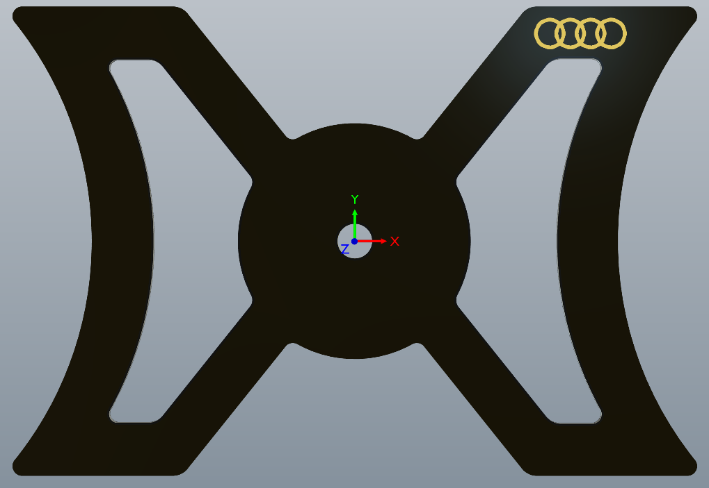

# Audi Phone Holders

## Introduction
A phone mount plate for the Audi A3 8P generation

Designed in [Altium Designer 21](https://www.altium.com/altium-designer/).

## Order
The PCBs can be ordered at [JLCPCB](https://jlcpcb.com/) with the following options:

| Option           |                          |
| ---------------- | ------------------------ |
| PCB Qty          | (minimum of 5 pieces)    |
| PCB Thickness    | 1.6                      |
| PCB Color        | Black (your choice)      |
| Surface Finish   | HASL (tin) / ENIG (gold) |
| Remove Order Nr  | Yes                      |

## Final result
